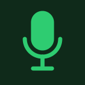

# Mic Picker for Stream Deck

[](https://github.com/RobertTheNerd/elgato-mic-picker/actions/workflows/ci.yml)
[](LICENSE)


**One key per microphone.** Press a key to make its mic your Mac's default input. Press it again to mute or unmute.
Each key always shows the mic's current state, even when you change inputs somewhere else.

<p>
  
  
  
  
</p>

## Features

- **Switch inputs in one press.** No more digging through System Settings → Sound mid-call.
- **Mute with the same key.** Once a mic is the default, its key becomes a mute toggle. It uses the device's own
  mute control, so every app (Zoom, Teams, Meet, OBS, …) stops getting audio.
- **Always up to date.** Keys update right away when the default input or mute state changes, or when a device is
  plugged in or out. That includes changes made in System Settings or by another app. It doesn't poll.
- **Keeps working after a replug.** Mics are saved by their CoreAudio UID, not their name. An unplugged mic keeps
  its label and shows as unavailable until it comes back.
- **No extra software.** A small native helper ships inside the plugin. You don't need Homebrew or
  `SwitchAudioSource`.

## Key states

| Key                                                        | Meaning                        | Pressing it          |
| ---------------------------------------------------------- | ------------------------------ | -------------------- |
|  | Connected, but not the default | Makes it the default |
|    | Default input, live            | Mutes it             |
|     | Default input, muted           | Unmutes it           |
|   | Not configured, or unplugged   | Shows ⚠              |

Some devices have no mute control, such as an iPhone used as a Continuity microphone. For those, the key can still
make the mic the default, but pressing it again shows ⚠ instead of muting.

## Requirements

- macOS 12 or later, on Apple silicon or Intel
- Stream Deck app 7.1 or later

## Install

1. Download `com.robert.mic-picker.streamDeckPlugin` from the
   [latest release](https://github.com/RobertTheNerd/elgato-mic-picker/releases/latest).
2. Double-click it. The Stream Deck app installs the plugin.

To build it yourself instead, see [Development](#development).

## Usage

1. In the Stream Deck app, find **Mic Picker → Select Microphone** in the action list. Type `mic` in the search
   box to find it quickly.
2. Drag it onto a key.
3. Click the key and choose a mic from the **Microphone** dropdown in the settings panel.
4. Repeat for each mic you switch between.

The key's title shows the device name, word-wrapped to fit. To use your own title, tick **Hide device name** or set
a title in the Stream Deck app.

## Troubleshooting

<details>
<summary><b>"Mic Picker" doesn't show up in the action list</b></summary>

The Stream Deck app only looks for new plugins when it starts. Quit it from the menu bar icon and open it again.

</details>

<details>
<summary><b>Pressing a key does nothing</b></summary>

Check the plugin log. Every press is logged along with what the plugin decided to do:

```sh
tail -f ~/Library/Application\ Support/com.elgato.StreamDeck/Plugins/com.robert.mic-picker.sdPlugin/logs/com.robert.mic-picker.0.log
```

If you see no `Key pressed:` lines, the plugin isn't getting the key events. Restart the Stream Deck app.

</details>

<details>
<summary><b>The key shows ⚠ when I press it</b></summary>

One of these is true:

- the mic isn't connected,
- no mic is configured for the key, or
- the mic is already the default and has no mute control.

</details>

<details>
<summary><b>The dropdown doesn't list my device</b></summary>

The dropdown lists every device that has input channels. To see what the plugin sees, run the bundled helper
directly:

```sh
~/Library/Application\ Support/com.elgato.StreamDeck/Plugins/com.robert.mic-picker.sdPlugin/bin/micctl list
```

</details>

## Development

You'll need Node.js 24+ (see `.nvmrc`) and the Xcode Command Line Tools, for `swiftc` and `lipo`.

```sh
npm install
npm run build        # universal micctl binary + bundled plugin.js
npm run link         # one-time: symlink the plugin into Stream Deck, then restart the Stream Deck app
npm run restart      # after each rebuild: stop the plugin; Stream Deck relaunches it right away
```

| Script                | What it does                                                          |
| --------------------- | --------------------------------------------------------------------- |
| `npm run check`       | Formatting, typecheck, unit tests, and manifest validation (as in CI) |
| `npm test`            | Unit tests for key state, press behavior, and title wrapping          |
| `npm run test:native` | Smoke tests for `micctl`. They never change your audio settings       |
| `npm run watch`       | Rebuilds `plugin.js` on every change                                  |
| `npm run pack`        | Builds `dist/com.robert.mic-picker.streamDeckPlugin`                  |
| `npm run images`      | Regenerates `docs/images/` from `src/icons.ts`                        |

For how the pieces fit together, see [docs/architecture.md](docs/architecture.md). To contribute, see
[CONTRIBUTING.md](CONTRIBUTING.md).

### `micctl`

The native helper also works as a standalone CLI:

```sh
micctl list                        # {"default":"<uid>","devices":[{"uid":"…","name":"…","muted":false}, …]}
micctl set <uid>                   # make <uid> the default input
micctl mute <uid> on|off|toggle    # change a device's input mute
micctl watch                       # print the list, then print it again on every change (exits on stdin EOF)
```

Exit codes: `0` success, `1` device not found or change refused, `2` usage error.

## License

[MIT](LICENSE). Third-party components are listed in [THIRD_PARTY_NOTICES.md](THIRD_PARTY_NOTICES.md).

This project isn't affiliated with or endorsed by Elgato or Corsair. Stream Deck is a trademark of Corsair Memory Inc.
